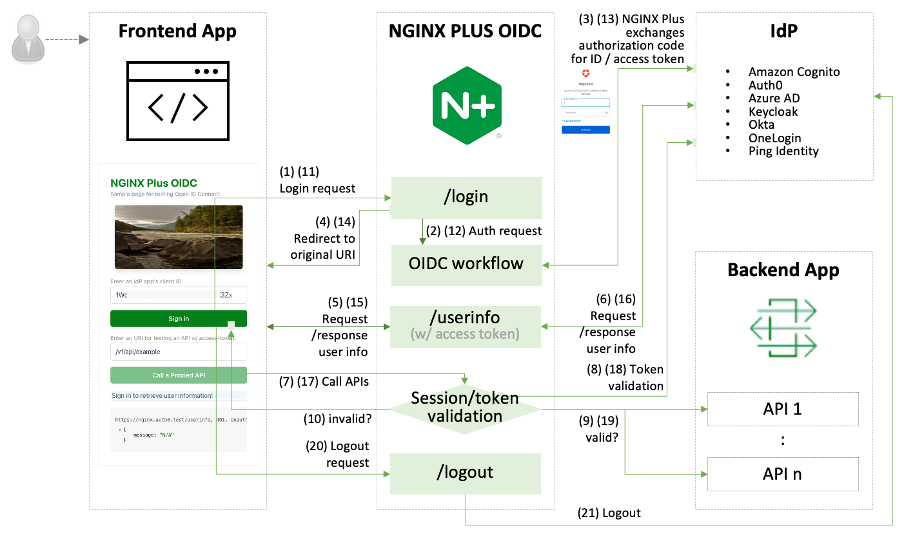

# nginx-oidc-multi-idps

Reference implementation of NGINX Plus as relying party for OpenID Connect authentication to support multiple IdPs per cluster.

This repo provides the information of how to set up multiple IdPs, integrate with NGINX Plus, and locally test using a containerized NGINX Plus app, a frontend OIDC simulation tool, and a NGINX Dev Portal.

- [Getting Started](#🏠-getting-started)
- [References](#📚-references)

 

## 🏠 Getting Started

### Set up an identity provider (IdP)

- [Create and configure an app in Amazon Cognito](https://github.com/nginx-openid-connect/nginx-oidc-amazon-cognito/blob/main/docs/01-IdP-Setup.md)
- [Create and configure an app in Auto0](https://github.com/nginx-openid-connect/nginx-oidc-auth0/blob/main/docs/01-Auth0-Setup.md)
- [Create and configure an app in Azure AD](https://github.com/nginx-openid-connect/nginx-oidc-azure-ad/blob/main/docs/01-IdP-Setup.md)
- [Create and configure an app in Keycloak](https://github.com/nginx-openid-connect/nginx-oidc-keycloak/blob/main/docs/01-IdP-Setup.md)
- [Create and configure an app in Okta](https://github.com/nginx-openid-connect/nginx-oidc-okta/blob/main/docs/01-IdP-Setup.md)
- [Create and configure an app in OneLogin](https://github.com/nginx-openid-connect/nginx-oidc-onelogin/blob/main/docs/01-IdP-Setup.md)
- [Create and configure an app in Ping Identity](https://github.com/nginx-openid-connect/nginx-oidc-ping-identity/blob/main/docs/01-IdP-Setup.md)

### Set up and Test a SSO application via NGINX Plus

- [Configure NGINX Plus OIDC](./docs/02-NGINX-Plus-Setup.md)
- [Locally Test an SSO app in a container ](./docs/03-Container-Test.md)

 

## 📚 References

- [NGINX OIDC Core v1.0: Forked from NGINX GitHub](https://github.com/nginx-openid-connect/nginx-oidc-core-v1)
- [NGINX OIDC Core v2.0: Forked from NGINX GitHub](https://github.com/nginx-openid-connect/nginx-oidc-core)
- [NGINX Plus: Single Sign-On](https://docs.nginx.com/nginx/deployment-guides/single-sign-on)
- [NGINX Management Suite](https://docs.nginx.com/nginx-management-suite/)
- [NGINX API Connectivity Manager](https://docs.nginx.com/nginx-management-suite/acm/)
